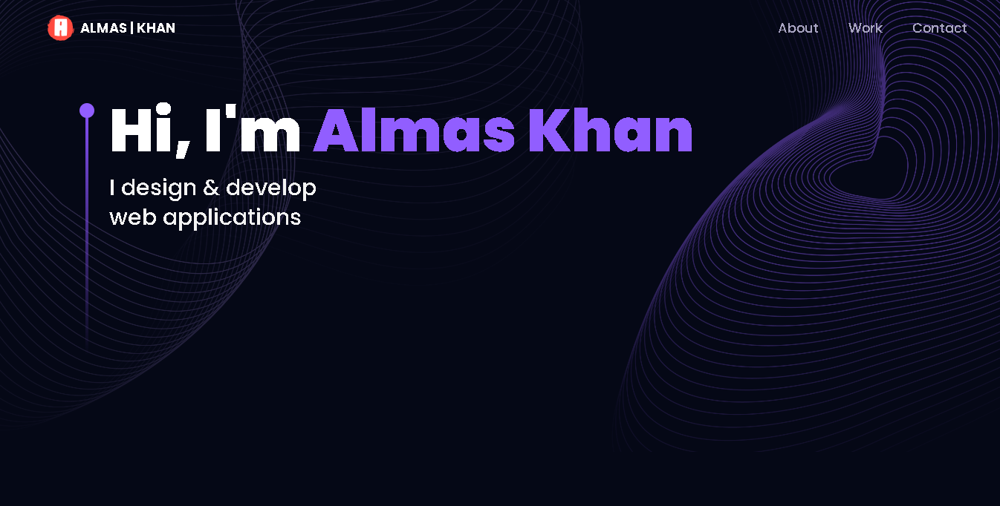

# 🚀Unveiling the Magic of My 3D Portfolio with Three.js and React.js

## Elevate Your Online Presence with a 3D Developer Portfolio
Elevate Your Online Presence with a 3D Developer Portfolio
Portfolio Preview

Welcome to my 3D Developer Portfolio – an immersive journey into the world of cutting-edge web development. In this course, you'll explore the fusion of technology and creativity, as we delve into the realms of ThreeJS, React Three Fiber, TailwindCSS, and Framer Motion. Get ready to craft a web presence that's as visually stunning as it is functionally exceptional.

#### React Three Fiber Excellence: 

Harness React Three Fiber, the renowned library that seamlessly integrates ThreeJS with React, for crafting captivating 3D experiences.

#### TailwindCSS Styling: 

Elevate your design game with TailwindCSS, the utility-first CSS framework loved by developers for its speed and flexibility.

#### Framer Motion Animation: 

Create websites that come to life with Framer Motion. Add smooth and engaging animations to captivate your audience.

#### Custom 3D Wonders: 
Craft and customize jaw-dropping 3D models, experimenting with lighting and spatial placement to create a visually immersive experience.

#### Code that Scales:

Implement industry-standard practices and Higher Order Components (HOCs) to ensure code is both reusable and scalable.

#### Stay Connected: 
Allow your audience to reach out effortlessly by adding a contact form to your site. Be accessible to your clients and collaborators.

#### Responsiveness and Speed: 

Your portfolio will shine on every device, with performance enhancements such as Suspense and Preload.

Discover the art of standing out in the digital landscape. Join me in creating a captivating online portfolio that not only showcases your skills but also ranks high in the eyes of search engines.
## 🔗 Social Links:

|  |  |
| --- | --- |

